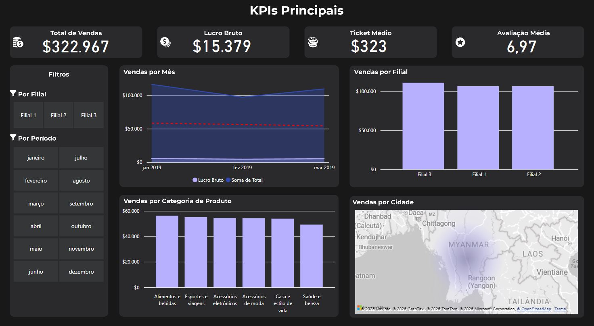
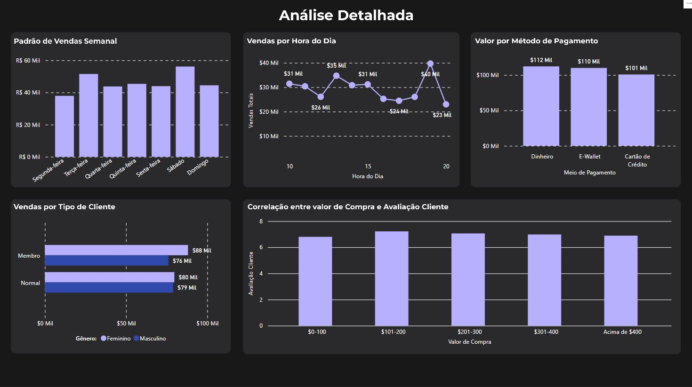

Vou atualizar o README para incluir as duas imagens. Para GitHub, precisamos fazer referência às imagens usando tags Markdown:

# Dashboard de Análise de Vendas - IAN Store

## Sobre o Projeto

Este repositório contém um dashboard analítico desenvolvido para a IAN Store, com foco na análise de desempenho de vendas do primeiro trimestre de 2019. O projeto foi desenvolvido utilizando Power BI e apresenta visualizações interativas que permitem análises detalhadas sobre tendências de vendas, padrões de consumo e segmentação de mercado.

## Visualizações do Dashboard

### Dashboard Principal - KPIs e Tendências


### Análise Detalhada - Padrões de Consumo e Correlações


## Funcionalidades

- **KPIs Principais**: Visualização dos principais indicadores de desempenho (Total de Vendas, Lucro Bruto, Ticket Médio e Avaliação Média)
- **Análise Temporal**: Gráficos de tendência com modelo preditivo para projeção futura
- **Segmentação por Período**: Filtros interativos para análise por mês
- **Segmentação por Filial**: Comparativo de desempenho entre unidades
- **Padrões de Consumo**: Análise horária de vendas
- **Performance por Categoria**: Distribuição de vendas por categorias de produtos
- **Análise de Correlação**: Relação entre valor de compra e satisfação do cliente

## Tecnologias Utilizadas

- **Power BI**: Desenvolvimento do dashboard e visualizações
- **DAX**: Criação de medidas calculadas e KPIs
- **Python**: Scripts para modelo preditivo (opcional)

## Insights Principais

- Tendência decrescente nas vendas durante Q1/2019
- Três picos distintos de vendas: 10h, 15h e 20h
- Concentração de vendas em categorias específicas ("Alimentos e bebidas")
- Correlação não linear entre valor gasto e satisfação do cliente
- Oportunidades de otimização operacional baseadas em padrões horários

## Como Usar

1. Clone este repositório
2. Abra o arquivo `IAN_Store_Dashboard.pbix` com o Power BI Desktop
3. Explore as diferentes visualizações e filtros
4. Utilize os segmentadores para análises específicas por período ou filial

## Estrutura do Repositório

```
├── README.md                       # Documentação do projeto
├── dashboard_1.JPG                 # Imagem do dashboard principal
├── dashboard_2.JPG                 # Imagem da análise detalhada
├── data/                           # Dados utilizados
│   └── IAN_Store_Dataset.xlsx      # Dataset principal
├── reports/                        # Relatórios gerados
│   └── Vendas_Q1_2019.pdf          # Relatório completo em PDF
└── dashboard/                      # Arquivos do dashboard
    └── IAN_Store_Dashboard.pbix    # Dashboard principal
```

## Recomendações Estratégicas

Com base nas análises, foram identificadas as seguintes recomendações:

1. Criação de task force para reversão imediata da tendência de queda
2. Implementação de sistema de gestão de turnos baseado nos padrões horários
3. Expansão do programa de membros com meta de conversão de 30%
4. Diversificação de categorias para reduzir dependência
5. Programa de benchmarking interno entre filiais

## Licença

Este projeto está sob a licença MIT. Veja o arquivo [LICENSE](LICENSE) para mais detalhes.
